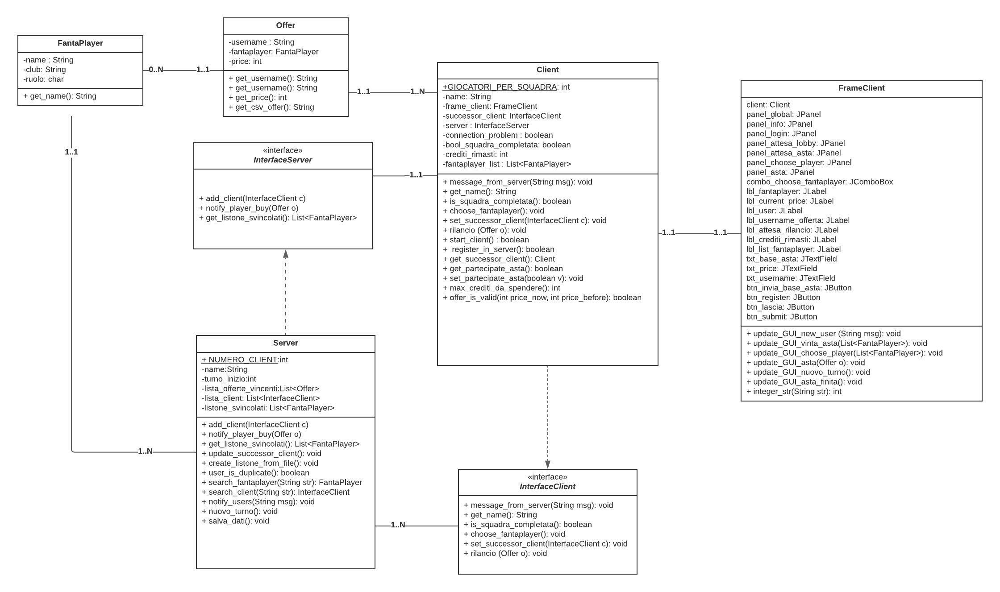
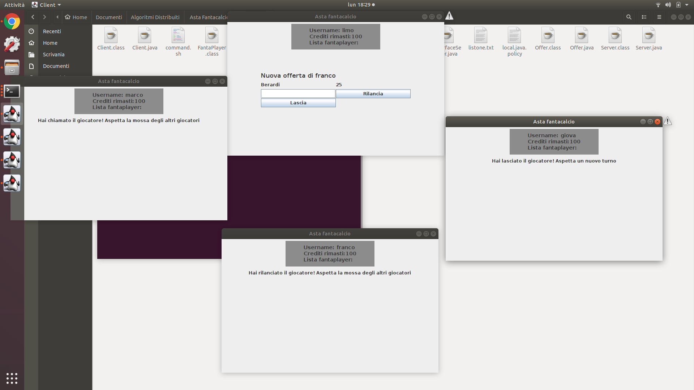

# Sistema per la gestione dell'asta del fantacalcio
Per il progetto del corso di Algoritmi Distribuiti è stato sviluppato un sistema per la gestione dell'asta del fantacalcio utilizzando la tecnologia Java RMI.

## Come eseguire il sistema

1) Mettersi dentro la cartella *code* ed attraverso il terminale eseguire lo script *command.sh* attraverso il comando (che compilerà i file):
> ./command.sh
2) Avviare il servizio *rmiregistry* da terminale col seguente comando:
> rmiregistry &
3) Sempre da terminale avviare il Server col seguente comando:
> java -Djava.security.policy=local.java.policy Server
4) Avviare da 4 terminali diversi 4 client con il comando (il numero di client è personalizzabile modificando una costante nella classe Client):
> java -Djava.security.policy=local.java.policy Client
> 
6) Ora il sistema è funzionante, basterà inserire il nome dei vari client e inizierà l'asta.

## Diagramma delle classi

## Schermata di sistema
Ecco una schermata di come si mostra il sistema, avviando tutti i client da una singola macchina:

